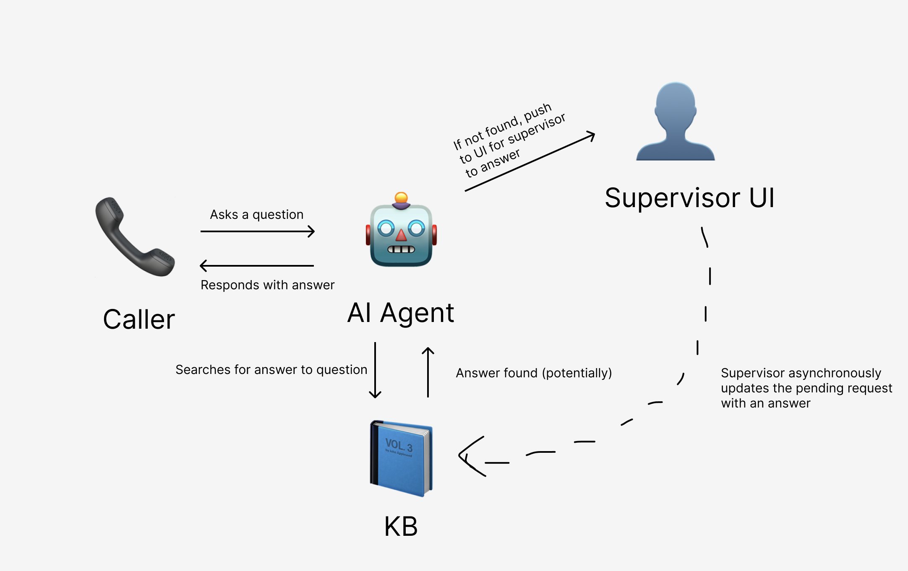

# Human-in-the-Loop Supervisor 
This project is a prototype for a human-in-the-loop AI receptionist. This AI agent answers FAQ-style questions for a fake salon, escalates to a human supervisor when it doesn't know the answer, and updates its knowledge base asynchronously with the new response from the supervisor. 



There are three main modules to this project - first, there's the AI Agent itself which represents the receptionist. Second, there's the supervisor UI which displays all pending requests. Third, there's this knowledge base which uses SQLite as a system of record and Pinecone for semantic search. The AI Agent is represented by `main.py`, the Flask supervisor dashboard is represented by `supervisor_ui.py`, and the database is initialized by running `init_db.py`. 

In order to replicate this project locally, you first need a frontend. See LiveKit's Agent Playground or Agent Sandbox offerings to speak to the agent (simulate the ASR-LLM-TTS pipeline). 

# Instructions
1. Clone the Repo locally
2. Create a virtual environment
   ```bash
   python3 -m venv venv
   source venv/bin/activate
   ```
3. Install dependencies
  ```bash
   pip install -r requirements.txt
   ```
4. Set up environment variables
5. Initialize the database
   ```bash
   python init_db.py
   ```
6. Run the agent
   ```bash
   python main.py
   ```
7. Run the supervisor UI
   ```bash
   python supervisor_ui.py
   ```

